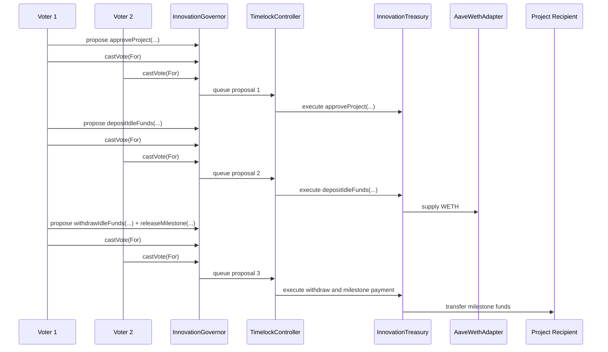

# Campus Innovation Fund DAO on Sepolia: Full-Score Implementation Plan

## Executive Summary

This project is a `Campus Innovation Fund DAO` deployed on Sepolia. The DAO represents a student-run treasury that funds campus innovation projects through on-chain governance. Token holders use a newly minted ERC20 governance token, `Campus Innovation Fund Token (CIF)`, to vote on which projects receive funding, when milestone payments are released, what reserve policies the treasury must follow, and how much idle capital may be deposited into Aave for yield.

The project is intentionally designed to be more than a simple voting contract. It combines a realistic business use case with a full governance stack, a constrained treasury, external data through Chainlink, a DeFi protocol integration through Aave, an interactive front-end, and measurable gas analysis. The goal is to deliver a final project that is technically correct, demonstrably original, clearly presented, and explicitly aligned with the assignment rubric.

The technical core is:

- `Campus Innovation Fund Token (CIF)` as an `ERC20Votes` governance token
- `InnovationGovernor` using OpenZeppelin governance modules
- `TimelockController` as the required execution layer for approved proposals
- `InnovationTreasury` that can fund approved projects and manage idle reserves
- `TreasuryOracle` using Chainlink `ETH/USD`
- `AaveWethAdapter` to deposit and withdraw idle `WETH` on Sepolia
- A lightweight front-end for governance, treasury visibility, and evidence presentation

The most important architectural rule is preserved from the original plan: when the Governor is bound to a `TimelockController`, proposal execution must pass through the timelock. The timelock, not the Governor, must own the treasury permissions and execute treasury actions after a successful vote and queue period. This is the central security and correctness property of the system.

## Assignment Alignment

| Assignment / Rubric Item | How This Project Satisfies It |
|---|---|
| Objective and description of project chosen | The project is a campus grant DAO that governs a student innovation treasury on Sepolia. |
| Why this project was chosen and expectations | The report will explain why a campus funding DAO is more original and realistic than a generic voting contract, and what technical and analytical outcomes are expected. |
| New ERC20 token or NFT is required | The team will mint and deploy `Campus Innovation Fund Token (CIF)`, an ERC20 governance token based on `ERC20Votes`. |
| Execution screenshots and verified Etherscan links | All core contracts will be deployed to Sepolia, verified on Etherscan, and accompanied by screenshots for deployment, delegation, proposing, voting, queueing, and execution. |
| All source code | The final submission will include Solidity contracts, tests, deployment scripts, front-end code, and supporting artifacts. |
| Complete documentation, metadata, JSON, and references | The final report will include architecture, design rationale, security assumptions, contract documentation, deployment JSON, proposal scenario JSON, front-end config JSON, and references. |
| Business use case for DAO | The DAO governs milestone-based funding for campus innovation projects and treasury reserve management. |
| Use of additional tokens as necessary | No second custom governance token is required. The treasury will use Sepolia `WETH` as the managed treasury asset for demonstration. |
| Summary of steps, unrealized P&L style assumptions, and lessons learned | The report and Excel workbook will include a step-by-step implementation summary, treasury scenario analysis, and a final lessons learned section. |
| Report or video to demonstrate the project | The required deliverable will be a polished PDF report supported by front-end screenshots and Sepolia transaction evidence. |
| Rigor of methodology | The plan includes threat modeling, invariants, unit tests, integration tests, security-focused negative tests, gas reporting, and static analysis. |
| Originality of project | The DAO is not only a ballot system; it combines grants governance, milestone-based disbursement, reserve policy, Aave yield parking, and Chainlink-based treasury monitoring. |
| Amount of work | The scope is explicitly scaled for a 3-person team and includes contracts, integrations, front-end, Excel analysis, evidence capture, and polished documentation. |
| Clarity of presentation | The final report and front-end will both be organized around the governance story, screenshots, tables, diagrams, and direct Etherscan links. |
| Quality of code | The implementation plan requires modular contracts, explicit interfaces, event logging, tests, documentation, and clear deployment artifacts. |
| Advanced functionality | The project commits to four advanced features: Chainlink oracle, Aave integration, interactive front-end, and gas measurement plus optimization. |

## Why This Project / Expected Outcomes

### Why this DAO was chosen

This project was chosen because it has a clear and realistic business purpose that can still be implemented cleanly on a testnet. A campus innovation fund is easy to explain, easy to demonstrate, and naturally suited to DAO governance: members can decide which student ideas deserve funding, how much capital should remain in reserve, and how idle assets should be managed until they are needed.

### Why it is more than a simple voting contract

This DAO does more than collect votes. It governs a treasury with actual rules and constraints:

- project approval is separated from cash disbursement
- funding is milestone-based rather than a single unrestricted transfer
- treasury reserve policy limits how much capital can be deployed
- idle capital can be deposited into Aave to demonstrate capital efficiency
- treasury value can be monitored using Chainlink market data

This creates a system with governance, treasury management, protocol integration, and measurable economic outcomes, which is much stronger than a minimal Governor demo.

### Expected outcomes

The team expects to demonstrate:

- a correctly wired Governor plus Timelock architecture
- a constrained treasury that only executes approved actions
- a full Sepolia governance lifecycle with verified contracts
- a live oracle-backed treasury valuation
- a working Aave deposit and withdrawal flow
- a simple front-end that makes the project easy to understand and grade
- a quantitative treasury scenario analysis in Excel

## Originality Hook

The originality of this project does not come from inventing a new governance primitive from scratch. It comes from combining standard governance primitives into a DAO that has a concrete operational identity and measurable decision logic.

The `Campus Innovation Fund DAO` is original in four ways:

1. It governs campus grant allocations instead of generic treasury transfers.
2. It uses milestone-based project funding instead of unrestricted one-time grants.
3. It treats idle treasury capital as a managed reserve that can earn yield in Aave.
4. It uses Chainlink pricing to present treasury NAV and support risk-aware reporting.

This gives the project a recognizable business narrative, real treasury rules, and enough technical depth to hold up under strict grading.

## Methodology

The implementation and report will follow a repeatable methodology:

1. Define the business use case and governance rules first.
2. Build the minimum secure governance spine with token, governor, timelock, and treasury.
3. Add domain-specific treasury constraints for project approval, milestone release, and reserve policy.
4. Integrate external systems only after the core governance flow works locally.
5. Validate behavior with unit tests, integration tests, negative tests, gas reports, and static analysis.
6. Reproduce the same lifecycle on Sepolia and capture a complete evidence chain.
7. Present both qualitative and quantitative outcomes through the PDF report, front-end screenshots, and Excel analysis.

This methodology is designed to satisfy the rubric for rigor, clarity, code quality, and advanced functionality.

## System Architecture

### Business actors

- `DAO Members`: hold CIF, self-delegate, propose, vote, and monitor treasury state
- `Student Project Teams`: receive milestone funding only after proposals pass
- `Treasury Manager Logic`: enforced on-chain through treasury rules rather than a trusted human operator

### High-level architecture

```mermaid
flowchart TB
  Members[DAO Members]
  Projects[Student Project Teams]

  Token[Campus Innovation Fund Token (ERC20Votes)]
  Gov[InnovationGovernor]
  Timelock[TimelockController]
  Treasury[InnovationTreasury]
  Oracle[TreasuryOracle (Chainlink ETH/USD)]
  Aave[AaveWethAdapter]

  Members -->|delegate and vote| Token
  Token -->|historical voting power| Gov
  Members -->|propose and cast votes| Gov
  Gov -->|queue and execute via timelock| Timelock
  Timelock -->|only authorized caller| Treasury
  Treasury -->|reads price data| Oracle
  Treasury -->|deposits idle WETH| Aave
  Treasury -->|releases milestone funding| Projects
```

### Governance rule that must never be violated

Because the Governor is timelock-bound, proposals must move through the sequence:

`propose -> vote -> succeed -> queue -> wait for timelock delay -> execute`

The treasury must trust the timelock, not the Governor directly. This rule is non-negotiable and must be visible in both the code and the final report.

### Sepolia demo lifecycle



## Project Scope and Fixed Technical Decisions

### Governance token

- Name: `Campus Innovation Fund Token`
- Symbol: `CIF`
- Standard: `ERC20Votes`
- Total supply at deployment: `1,000,000 CIF`
- Initial demo allocation:
  - `200,000 CIF` to voter wallet A
  - `200,000 CIF` to voter wallet B
  - `200,000 CIF` to voter wallet C
  - `400,000 CIF` reserved for treasury-controlled governance reserve or future DAO allocations

### Governance configuration

The following values are fixed for implementation unless local rehearsal proves that a small adjustment is necessary for demo practicality:

- `proposalThreshold = 10,000 CIF`
- `quorumFraction = 4%`
- `votingDelay = 1 block`
- `votingPeriod = 20 blocks`
- `timelockMinDelay = 120 seconds`

These values are intentionally short because the project is a Sepolia demonstration, not a production mainnet launch. The report must explain that they are testnet-friendly governance parameters.

### Treasury asset model

- Treasury asset used in the demo: `Sepolia WETH`
- Oracle valuation basis: `Chainlink ETH/USD`
- Normalization assumption: `WETH` is valued the same as `ETH`
- Aave support is intentionally limited to one asset on Sepolia for safety, clarity, and implementation focus

### Treasury policy defaults

The first implementation should use these defaults:

- `minLiquidReserveBps = 3000` (30% of treasury value must remain liquid)
- `maxSingleGrantBps = 2000` (a single project cannot be approved above 20% of treasury value at the time of approval)
- `stalePriceThreshold = 3600` seconds

These policy values may later be adjustable through governance, but the initial plan fixes them so the implementation has a clear baseline.

## Contract Design and Intended Public Interfaces

The project should remain modular and reflect the business rules directly in the public interface design.

### 1. CampusInnovationFundToken

Purpose:

- mint and distribute the governance token
- support delegation and historical vote tracking

Planned interface:

```solidity
interface ICampusInnovationFundToken {
    function mint(address to, uint256 amount) external;
    function delegate(address delegatee) external;
    function getVotes(address account) external view returns (uint256);
    function getPastVotes(address account, uint256 timepoint) external view returns (uint256);
    function getPastTotalSupply(uint256 timepoint) external view returns (uint256);
}
```

### 2. InnovationGovernor

Purpose:

- create proposals
- collect votes
- queue and execute approved actions through timelock

Planned OpenZeppelin module stack:

- `GovernorSettings`
- `GovernorVotes`
- `GovernorVotesQuorumFraction`
- `GovernorCountingSimple`
- `GovernorTimelockControl`

Planned interface:

```solidity
interface IInnovationGovernor {
    function propose(
        address[] memory targets,
        uint256[] memory values,
        bytes[] memory calldatas,
        string memory description
    ) external returns (uint256 proposalId);

    function castVote(uint256 proposalId, uint8 support) external returns (uint256 weight);

    function queue(
        address[] memory targets,
        uint256[] memory values,
        bytes[] memory calldatas,
        bytes32 descriptionHash
    ) external returns (uint256 proposalId);

    function execute(
        address[] memory targets,
        uint256[] memory values,
        bytes[] memory calldatas,
        bytes32 descriptionHash
    ) external payable returns (uint256 proposalId);
}
```

### 3. InnovationTreasury

Purpose:

- enforce approved project funding rules
- hold treasury WETH
- manage liquid reserves
- interact with the Aave adapter

Treasury is intentionally a constrained grant treasury, not a generic arbitrary-call wallet.

Planned project data model:

```solidity
struct Project {
    address recipient;
    uint256 maxBudgetWeth;
    uint256 releasedWeth;
    uint8 milestoneCount;
    uint8 milestonesReleased;
    bool active;
}
```

Planned interface:

```solidity
interface IInnovationTreasury {
    function approveProject(
        bytes32 projectId,
        address recipient,
        uint256 maxBudgetWeth,
        uint8 milestoneCount
    ) external;

    function releaseMilestone(
        bytes32 projectId,
        uint8 milestoneIndex,
        uint256 amountWeth
    ) external;

    function depositIdleFunds(uint256 amountWeth) external;
    function withdrawIdleFunds(uint256 amountWeth) external;

    function setRiskPolicy(
        uint256 minLiquidReserveBps,
        uint256 maxSingleGrantBps,
        uint256 stalePriceThreshold
    ) external;

    function navUsd() external view returns (uint256);
}
```

### 4. TreasuryOracle

Purpose:

- read Chainlink `ETH/USD`
- expose a treasury valuation helper
- block stale-price dependent logic

Planned interface:

```solidity
interface ITreasuryOracle {
    function latestEthUsd() external view returns (int256 answer, uint256 updatedAt, uint8 decimals);
    function isStale() external view returns (bool);
    function navUsd(uint256 wethAmount) external view returns (uint256);
}
```

### 5. AaveWethAdapter

Purpose:

- deposit treasury WETH into Aave
- withdraw treasury WETH from Aave

Planned interface:

```solidity
interface IAaveWethAdapter {
    function supply(uint256 amountWeth) external;
    function withdraw(uint256 amountWeth) external;
    function suppliedBalance() external view returns (uint256);
}
```

## Security Design and Required Invariants

### Security principles

- Treasury actions must be gated by the timelock.
- Governance must not bypass the queue step.
- Project approval must be separate from milestone disbursement.
- Oracle-dependent logic must not run on stale market data.
- Aave interactions must not violate reserve requirements.
- No project can receive more than its approved budget.

### Required invariants

1. `Only TimelockController can move treasury funds`
   - Any direct EOA call to treasury state-changing funding methods must revert.

2. `A proposal cannot execute before it is queued and before delay expires`
   - Execution attempts before queueing or before timelock readiness must revert.

3. `No milestone release without project approval`
   - Releasing funds for an unknown or inactive project must revert.

4. `No funding above project cap`
   - Total released amount for a project must never exceed `maxBudgetWeth`.

5. `Idle-fund deployment must preserve the reserve floor`
   - Deposits to Aave must revert if they would leave less than the configured liquid reserve.

6. `Oracle staleness blocks guarded logic`
   - Price-aware actions or reports must fail or clearly report invalidity when oracle data is stale.

7. `Treasury NAV must reflect both liquid and deployed treasury assets`
   - NAV reporting must incorporate treasury WETH plus Aave-supplied WETH.

## Committed Advanced Features for Full Marks

The following advanced features are committed scope, not optional ideas:

1. `Chainlink oracle`
   - `TreasuryOracle` reads `ETH/USD` and reports treasury NAV in USD.

2. `Aave integration`
   - `AaveWethAdapter` deposits and withdraws idle treasury WETH on Sepolia.

3. `Interactive front-end`
   - A lightweight application will allow wallet connection and present governance, treasury, and evidence pages.

4. `Gas measurement and optimization`
   - The team will collect baseline gas data, perform one optimization pass, and present before/after results.

## Demo Story for Sepolia

The Sepolia demonstration must follow a precise and repeatable narrative so that screenshots, transaction hashes, and report sections match one another.

### Initial treasury state

- Treasury starts with `5.0 WETH`
- Three member wallets each hold and self-delegate `200,000 CIF`
- Treasury policy is set to:
  - `30%` minimum liquid reserve
  - `20%` maximum single-grant budget relative to treasury value
  - `1 hour` stale-price threshold

### Proposal 1: approve a student project

Project:

- Project name in the report: `Smart Recycling Kiosk`
- `projectId = keccak256("SMART_RECYCLING_KIOSK")`
- Recipient: designated Sepolia student-project wallet
- Max budget: `1.0 WETH`
- Milestones: `2`

Expected result:

- Project becomes active in treasury state
- No funds are transferred yet
- The front-end shows the approved project entry

### Proposal 2: deposit idle treasury funds into Aave

Action:

- Deposit `3.0 WETH` into Aave through `AaveWethAdapter`

Expected result:

- Treasury still keeps `2.0 WETH` liquid, which stays above the `30%` reserve requirement
- Aave supplied balance becomes visible in contract state and front-end
- Treasury NAV reporting reflects both liquid and deployed WETH

### Proposal 3: withdraw and release the first milestone

Action:

- Withdraw `0.5 WETH` from Aave
- Release milestone 0 payment of `0.5 WETH` to the approved project recipient

Expected result:

- Recipient balance increases
- Project `releasedWeth` becomes `0.5 WETH`
- Project still remains under the approved budget ceiling
- Final screenshots clearly show the end-to-end treasury effect

## Testing Strategy

The testing plan is organized around what a grader will expect to see.

### Core functionality tests

- token minting and delegation activate voting power
- historical vote snapshots are used correctly
- governor proposal lifecycle works from `propose` to `execute`
- treasury project approval persists correct metadata
- treasury milestone release updates project accounting
- oracle valuation returns expected NAV values
- Aave adapter supply and withdraw paths update treasury state

### Negative and security tests

- direct treasury funding call from EOA reverts
- proposal execution before queue reverts
- proposal execution before timelock delay expires reverts
- milestone release for inactive project reverts
- milestone release beyond approved budget reverts
- Aave deposit that would break reserve floor reverts
- stale oracle blocks guarded reporting or policy operations

### Sepolia acceptance tests

- deployment and verification of all contracts
- self-delegation for all voter wallets
- successful Proposal 1 lifecycle on-chain
- successful Proposal 2 lifecycle on-chain
- successful Proposal 3 lifecycle on-chain
- final treasury state and recipient balance match report screenshots

### Evidence-producing demo tests

- script that prints deployed addresses and proposal ids
- script or checklist for each screenshot needed in the report
- transaction hash table that can be copied into the final PDF
- front-end evidence page that links every contract and transaction

## Quality Assurance, Analysis, and Engineering Signals

To make the project stand up under strict grading, implementation is not enough. The team must also produce visible engineering evidence.

### Required engineering artifacts

- unit and integration test results
- coverage report
- gas report with before and after optimization
- static-analysis output
- deployment logs
- verified Etherscan links

### Gas reporting

The team must measure gas for at least the following actions:

- `propose`
- `castVote`
- `queue`
- `execute`
- `approveProject`
- `releaseMilestone`
- `depositIdleFunds`
- `withdrawIdleFunds`

The report must include:

- baseline gas numbers
- one implemented optimization pass
- updated gas numbers
- a short explanation of what changed and why it matters

### Static analysis

At least one formal static-analysis artifact must be produced. The preferred choice is `Slither`. The team should resolve or justify any findings related to:

- access control
- unsafe external calls
- reentrancy exposure
- dead code or unused privileged functions

## Front-End Scope

The front-end exists to improve clarity, originality, and evidence quality. It does not need to be a production application, but it must make the DAO easy to understand.

### Fixed pages

1. `Overview`
   - project summary
   - deployed addresses
   - treasury headline metrics

2. `Proposals`
   - active and completed proposals
   - proposal descriptions
   - vote status and outcome

3. `Treasury & NAV`
   - liquid WETH
   - Aave-supplied WETH
   - Chainlink ETH/USD price
   - treasury NAV in USD
   - approved projects and released amounts

4. `Evidence`
   - contract Etherscan links
   - transaction hash table
   - screenshot references used in the report

### Front-end interaction requirements

- connect wallet
- self-delegate CIF
- read proposal state
- submit or surface proposal data used in the demo
- cast votes
- display final treasury outcomes after execution

## Evidence and Deliverables

The final project must produce specific artifacts that can be cited in the report and, if needed, shown directly to the grader.

### On-chain evidence

- verified Sepolia address for `CampusInnovationFundToken`
- verified Sepolia address for `InnovationGovernor`
- verified Sepolia address for `TimelockController`
- verified Sepolia address for `InnovationTreasury`
- verified Sepolia address for `TreasuryOracle`
- verified Sepolia address for `AaveWethAdapter` if deployed separately
- transaction hashes for self-delegation and all three proposal lifecycles

### File-based deliverables

- Solidity contracts in `src/`
- tests in `test/`
- deployment scripts in `scripts/` or `ignition/`
- `deployments.sepolia.json`
- `proposal_scenarios.json`
- front-end config and ABI JSON files
- gas report files
- static-analysis report
- screenshot checklist and image files
- final PDF report
- Excel treasury analysis workbook

### JSON and metadata artifacts

To satisfy the assignment requirement around metadata and JSON, the project will include:

- `deployments.sepolia.json`
  - addresses, constructor arguments, network info, and verification URLs
- `proposal_scenarios.json`
  - human-readable proposal descriptions, calldata purpose, and expected outcomes
- front-end config and ABI JSON
  - contract addresses, ABI references, and network configuration

## Excel Analysis Plan

The Excel workbook is part of the grading strategy, not an afterthought. It will translate treasury activity into a quantitative analysis section that is easy to grade.

### Workbook purpose

Show how treasury value and sustainability change under different market and grant assumptions.

### Required scenarios

- `Bear`, `Base`, and `Bull` ETH price paths
- `0%`, `Moderate`, and `Strong` Aave yield assumptions
- `Light`, `Medium`, and `Heavy` project payout schedules
- reserve-ratio sensitivity under different treasury management choices

### Required outputs

- treasury NAV over time
- unrealized gain or loss style interpretation from ETH price movement
- grant-outflow versus reserve sustainability
- charts for treasury value and reserve ratio
- short written interpretation for inclusion in the report

## Team Work Allocation (3-Person)

The plan assumes a 3-person team and scales the work accordingly.

### Member 1: Governance and deployment owner

- CIF token
- Governor
- Timelock wiring
- deployment scripts
- Sepolia verification workflow

### Member 2: Treasury and integration owner

- InnovationTreasury
- TreasuryOracle
- AaveWethAdapter
- core tests and negative tests
- gas and static-analysis artifacts

### Member 3: Front-end and submission owner

- front-end pages and integration
- report structure and graphics
- screenshot capture and evidence indexing
- Excel workbook
- final packaging of links, tables, and appendices

All three members should review the final governance demo flow so the project clearly reflects a 3-person workload.

## Evidence Capture Checklist

The report should later be assembled from the following evidence checklist:

1. deployment screenshots for each contract
2. Etherscan verification screenshots and links
3. wallet self-delegation screenshots
4. Proposal 1 propose, vote, queue, and execute screenshots
5. Proposal 2 propose, vote, queue, and execute screenshots
6. Proposal 3 propose, vote, queue, and execute screenshots
7. treasury balances before and after Aave deposit
8. treasury balances before and after milestone payment
9. front-end screenshots for all four pages
10. gas report and static-analysis screenshots or exported summaries

## Final Report Structure

The final PDF should follow this structure so that each assignment requirement is visible and easy to grade:

1. Title page
2. Objective and project description
3. Why we chose this project and what we expected
4. Business use case
5. System architecture and governance flow
6. Contract design and security controls
7. Testing and methodology
8. Advanced functionality
9. Sepolia deployment and evidence
10. Excel treasury analysis
11. Step-by-step summary of what we did
12. What we learned
13. References
14. Appendix with addresses, tx hashes, and artifact index

## Implementation Roadmap

The implementation should follow this milestone order.

### Milestone 1: Governance spine

- implement CIF token
- implement InnovationGovernor
- deploy and wire TimelockController
- confirm local governance lifecycle

### Milestone 2: Treasury rules

- implement InnovationTreasury
- add project approval and milestone-release logic
- add reserve policy checks

### Milestone 3: Oracle and Aave

- implement TreasuryOracle with Chainlink
- implement AaveWethAdapter
- integrate treasury valuation and idle-fund management

### Milestone 4: Tests and QA

- complete unit tests
- complete integration and negative tests
- collect coverage, gas, and static-analysis results

### Milestone 5: Sepolia deployment and verification

- deploy all contracts
- verify on Etherscan
- fund treasury and distribute CIF
- complete the three-proposal demo story

### Milestone 6: Front-end and final evidence

- complete Overview, Proposals, Treasury & NAV, and Evidence pages
- capture screenshots
- finalize JSON artifacts
- assemble report-ready evidence

### Milestone 7: Report and Excel workbook

- produce treasury scenario analysis
- write the final PDF
- align every section of the report with this plan and the rubric

## References

The implementation and report should rely primarily on official or primary sources:

- OpenZeppelin governance documentation
- OpenZeppelin `ERC20Votes` documentation
- Chainlink Data Feeds documentation
- Aave V3 documentation
- Etherscan verification documentation
- course assignment handout and grading rubric

These sources should support the implementation and final report, but the plan itself should remain project-focused rather than citation-heavy.
